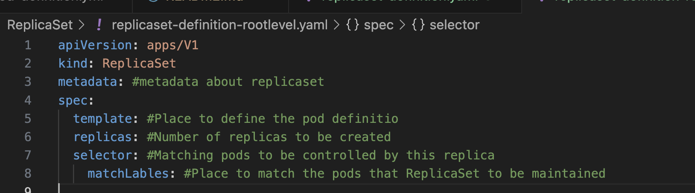
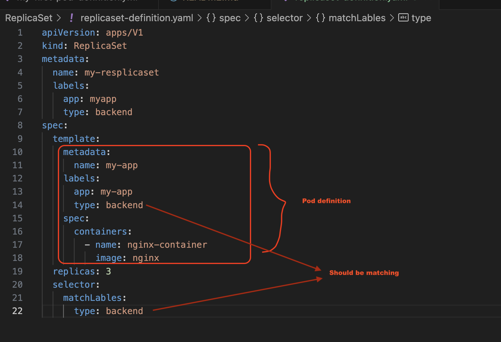
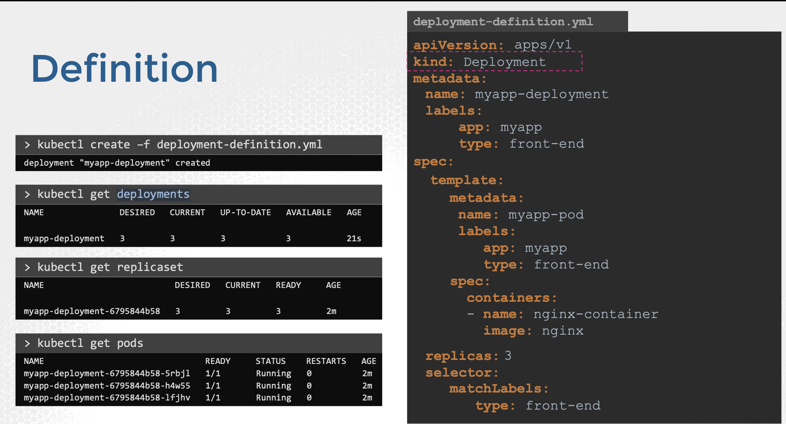

# CKAD_Preparation
Certified Kubernetes application developer certification preparation guide and learnings 

Root level attributes of every kubernetes definition files are below

* `apiVersion`
* `kind`
* `metadata`
* `spec`

## Useful Kubectl Commands 
### Pod
*   `kubectl get pods` 
    -  This can be used to get the currently running pods
*  `kubectl run <pod-name> --image=<image-name>`
    -  Easiest way to create the pod using **kubectl run** command
*  `kubectl describe pod <pod-name>` 
    -  Use this to get the insights about the pod like name, Node, Image and other metadata
*  `kubectl delete pod <pod-name> [--force]` 
    - This is to delete the pod --force is an optional param here 

*  `kubectl get pod <pod-name> -o yaml > pod-definition.yaml`
    - You may extract the pod definition to a file using this command

*  `kubectl edit pod <pod-name>`
    - You can utilize this command to modify the properties of the pod

*  `kubectl run <pod-name> --image=<image-name> --dry-run=client -o yaml > file_name.yaml`
    - Easiest way to create the pod definition file using exam environment once the file is ready you can use the next command to create the pod
*  `kubectl create|apply  -f pod_definition_file.yaml`
    - This is to create pod using pod-definition-file

### ReplicaSet
#### Replication controller is replaced by ReplicaSet
* Helps in ensuring the specified number of pods is running, by having said that the **High availability** is achieved.

* Another usecase is creating multiple container to share the load accross the pods (**Load balancing & Scaling**)  

* When the demand increases and out of resources in the existing worker node it can create the additional pods to balance the node in another worker node

#### Root level attributes for every ReplicaSet 

#### A sample ReplicaSet

> Replicaset can also manage the pod that has not been created as part of the replicaset creation using the **selector**

#### Scaling replicas
- There are different ways to scale the number of replicas, lets take a look at the possible ways
* You can update the **replicas** in your replicaSet definition file and run the below command to scale in
    - `kubectl replace -f replicaset-definition.yaml`
* You can also use the **scale** command like below, this will also update replicas as 6 in your replicaset-definition file.
    - `kubectl scale --replicas=6 -f replicaset-definition.yaml`
    - `kubectl scale rs --replicas=6 <replicaset-name>`
        - this does not update the replicas count in replicaset-definition file

#### Other useful commands 
* `kubectl create -f replicaset-definition.yaml`
   - Used to create the replicaset
* `kubectl edit replicaset <replicaset-name>`
   - Used to edit the replicaset details like image,label and resolve other errors
* `kubectl describe rs <replicaset-name>`
   - Used to describe the replicaset and view the metadata about rs and assiciated containers 
* `kubectl get replicaset`
   - Used to get the replicasets
* `kubectl delete replicaset my-app`
   - Used to delete the replicaset and also undelying pods
> scaling and replcing you can refer the previous section 

### Deployments

> Deployments comes with the below capabilities 
 - Upgrade the underlying instances seemlessly using the feature **rolling updates**
 - Undo changes
 - Pause and Resume changes

  

 #### Other useful commands 
 * `kubectl get deployments`
 * `kubectl create -f <deployment-definition-file.yaml>`
    - This can be used to create the deployment with the definition file
* `kubectl create deployment <deployment-name> --image=<image-name> --replicas=6`
    - This command will create the deployment,replicaset and pods with desired count specified (you dont need to manually create deployment definition file)

### Namespaces
> By using namespaces, you can partition resources, create separate environments, and prevent naming collisions between objects. They are commonly used to create isolation between different applications or teams using the same Kubernetes cluster.

#### Key concepts about namespaces in k8s
- **Isolation**: Each namespace provides a distinct scope for Kubernetes resources. Objects in one namespace are isolated from the resources in other namespaces, except where explicitly configured otherwise.

- **Resource Quotas and Limits**: Namespaces can have resource quotas and limits set, allowing administrators to control the amount of resources (CPU, memory, etc.) that can be consumed within each namespace.

- **Default Namespace**: When objects are created without specifying a namespace, they are created in the default namespace (often named default).

- **Namespaces in Use**: Common namespaces include kube-system, where Kubernetes system components are deployed, and kube-public, which is generally used for resources that need to be accessible across the whole cluster.

### ConfigMaps

* `kubectl get configmap` OR `kubectl get cm`
    - list all the configmaps available in the default namespace
* `kubectl describe cm <cm-name>`
    - describe the configmap
* `kubectl create cm <cm-name> --from-literal=APP_COLOR=RED --from-literal-APP_OTHER=disregard`
  - create the configmap from the the literal
* `kubectl create cm app-config --from-file=app.properties`
  - create the configmap from the file

 #### Other useful commands 

* `kubectl get namespaces` OR `kubectl get ns`
    - List all the namespaces available in the cluster
* `kubectl get pods --namespace=research` OR `kubectl get pods -n=research`
    - List all the pods under a namespace
* `kubectl run pod --image=<image-name> -n=<namespace>`
    - This creates a pod under a given namespace
* `kubectl get pods --all-namespaces` OR `kubectl get pods -A`
    - List all the pods from all the namespaces, *this can be used to find namespace of the pod where its get deployed Exam tip*

### Imperative commands
* `--dry-run`: By default, as soon as the command is run, the resource will be created. If you simply want to test your command, use the `--dry-run=client` option. This will not create the resource. Instead, tell you whether the resource can be created and if your command is right.

* `-o yaml`: This will output the resource definition in YAML format on the screen.
> Use the above two in combination along with Linux output redirection to generate a resource definition file quickly, that you can then modify and create resources as required, instead of creating the files from scratch.

#### Easiest way to generate manifest file 
* `kubectl run nginx --image=nginx --dry-run=client -o yaml  > nginx-pod.yaml`

* `kubectl create deployment nginx --image=nginx --dry-run=client -o yaml > nginx-deployment.yaml`

    - if you dont want to create the definition file you can use the below command
 `kubectl create deployment webapp --image=kodekloud/webapp-color --replicas=3`

 > You can then update the YAML file with the replicas or any other field before creating the deployment for creating the resources you can simply run `kubectl create -f <manifest-file>`

* `kubectl run custom-nginx --image=nginx --port=8080`
    - This creates a new pod called custom-nginx using the nginx image and expose it on container port 8080

* `kubectl run redis --image=redis:alpine --label="tier=db"`
    - This creates a redis pod with given image and label in an imperative way

* `kubectl create ns <name-space>`

* `kubectl create deployment redis-deploy --image=redis --replicas=2 -n dev-ns`
    - Create a new deployment called redis-deploy in the dev-ns namespace with the redis image. It should have 2 replicas.

* `kubectl run httpd --image=httpd:alpine --port=80 --expose=true`
    - Create a pod called httpd using the image httpd:alpine in the default namespace. Next, create a service of type ClusterIP by the same name (httpd). The target port for the service should be 80.

* `kubectl expose pod redis --port=6379 --name redis-service
service/redis-service exposed`
    - it Creates a service **redis-service** to expose the redis application within the cluster on port **6379**
    - Pod redis is already created and creating a service to expose on port 6379
